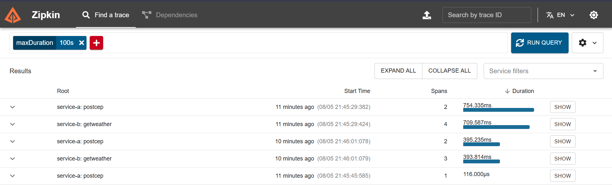
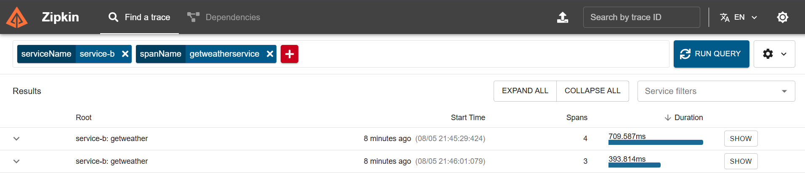
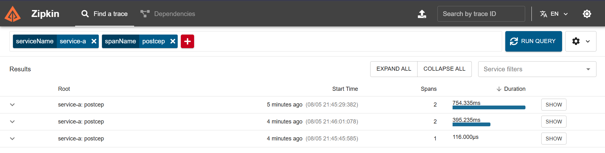

# Weather System 🌤️


Bem-vindo ao **Weather System**, um projeto do meu portfólio que implementa uma API RESTful em Go com dois microsserviços:

- **Serviço A**: Recebe um CEP via POST, valida o input, e encaminha para o Serviço B.
- **Serviço B**: Consulta a localidade (ViaCEP), obtém a temperatura (WeatherAPI), e retorna os dados em Celsius, Fahrenheit e Kelvin.
- **Tracing**: Usa OpenTelemetry e Zipkin para rastrear requisições entre os serviços.

---

## 📋 Descrição

### Serviço A
- **Endpoint**: `POST /cep` com `{"cep": "29902555"}`
- **Funcionalidade**: Valida o CEP (8 dígitos numéricos) e encaminha para o Serviço B.
- **Respostas**:
  - ✅ Sucesso: HTTP 200, retorna o JSON do Serviço B.
  - ❌ CEP inválido: HTTP 422, `{"message": "invalid zipcode"}`
  - ⚠️ Erro de comunicação: HTTP 500, `{"message": "error communicating with Service B"}`

### Serviço B
- **Endpoint**: `GET /weather/:cep`
- **Funcionalidade**: Consulta a ViaCEP para obter a cidade, consulta a WeatherAPI para a temperatura e retorna:
  ```json
  {
    "city": "São Paulo",
    "temp_C": X,
    "temp_F": Y,
    "temp_K": Z
  }
  ```
- **Respostas**:
  - ✅ Sucesso: HTTP 200
  - ❌ CEP inválido: HTTP 422, `{"message": "invalid zipcode"}`
  - ❌ CEP não encontrado: HTTP 404, `{"message": "can not find zipcode"}`
  - ⚠️ Erro interno: HTTP 500, `{"message": "internal server error"}`

### Tracing (Observabilidade)
OpenTelemetry gera spans como:
- `PostCEP`
- `ForwardToServiceB`
- `GetWeather`
- `ViaCEPRequest`
- `WeatherAPIRequest`

Todos enviados ao **Zipkin** para visualização.

---

## 🛠️ Tecnologias

- 🐹 **Go** — linguagem principal.
- 🐳 **Docker** — containerização dos serviços.
- 🔍 **OpenTelemetry/Zipkin** — tracing distribuído.
- 🔗 **Gorilla Mux** — roteamento HTTP.
- 🌍 **ViaCEP** e **WeatherAPI** — integração com APIs externas.

---

## 🧪 Como Testar

### Pré-requisitos

- [Docker Desktop](https://www.docker.com/products/docker-desktop) (versão 27.0.3 ou superior)
- Chave da WeatherAPI: obtenha em [weatherapi.com](https://www.weatherapi.com)

### Passos

1. **Clone o repositório**:
   ```bash
   git clone https://github.com/Eliezer2000/Weather-System.git
   cd weather-system
   ```

2. **Configure o `.env`**:

   Crie um arquivo `.env` na raiz do projeto com o seguinte conteúdo:

   ```
   WEATHER_API_KEY=<sua-chave-da-weatherapi>
   ```

3. **Execute com Docker Compose**:
   ```bash
   docker-compose up --build
   ```

   Isso iniciará:
   - Serviço A na porta `8081`
   - Serviço B na porta `8080`
   - Zipkin na porta `9411`

4. **Testes - Serviço A**:

   - ✅ **CEP válido**:
     ```bash
     curl -X POST http://localhost:8081/cep \
     -H "Content-Type: application/json" \
     -d '{"cep": "01001000"}'
     ```
     **Resposta**:
     ```json
     {"city": "São Paulo", "temp_C": X, "temp_F": Y, "temp_K": Z}
     ```

   - ❌ **CEP inválido**:
     ```bash
     curl -X POST http://localhost:8081/cep \
     -H "Content-Type: application/json" \
     -d '{"cep": "123"}'
     ```
     **Resposta**:
     ```json
     {"message": "invalid zipcode"}
     ```

   - ❌ **CEP inexistente**:
     ```bash
     curl -X POST http://localhost:8081/cep \
     -H "Content-Type: application/json" \
     -d '{"cep": "99999999"}'
     ```
     **Resposta**:
     ```json
     {"message": "can not find zipcode"}
     ```

5. **Testes - Serviço B (opcional)**:
   ```bash
   curl http://localhost:8080/weather/01001000
   ```

6. **Visualize os Traces no Zipkin**:

   Acesse [http://localhost:9411](http://localhost:9411) no navegador.

   Clique em **"Find Traces"** para ver os spans:

   - PostCEP (Serviço A)
   - ForwardToServiceB (Serviço A)
   - GetWeather (Serviço B)
   - ViaCEPRequest (Serviço B)
   - WeatherAPIRequest (Serviço B)

   **Exemplo de trace**:

   
   ##
   
   ##
   
   ##

7. **Parar os serviços**:
   ```bash
   docker-compose down
   ```

---

## 📁 Estrutura do Projeto

```plaintext
weather-system/
├── service-a/
│   ├── cmd/server/main.go        # Ponto de entrada do Serviço A
│   ├── internal/config/          # Configurações
│   ├── internal/handler/         # Handlers HTTP
│   ├── internal/model/           # Modelos de dados
│   ├── internal/service/         # Lógica de negócio
│   ├── Dockerfile
│   ├── go.mod
├── service-b/
│   ├── cmd/server/main.go        # Ponto de entrada do Serviço B
│   ├── internal/config/
│   ├── internal/handler/
│   ├── internal/model/
│   ├── internal/service/
│   ├── Dockerfile
│   ├── go.mod
├── screenshots/
│   ├── trace_example.png         # Print do Zipkin
├── .env                          # Variáveis de ambiente (não versionado)
├── docker-compose.yml            # Orquestração dos serviços
├── .gitignore
└── README.md
```

---

## 📜 Licença

Este projeto está licenciado sob a licença MIT. Veja o arquivo [LICENSE](LICENSE) para detalhes.

---

## 📊 Resultados dos Testes

| Caso de Teste       | CEP         | Status HTTP | Resposta |
|---------------------|-------------|-------------|----------|
| CEP válido          | 01001000    | 200         | `{"city": "São Paulo", ...}` |
| CEP inválido        | 123         | 422         | `{"message": "invalid zipcode"}` |
| CEP inexistente     | 99999999    | 404         | `{"message": "can not find zipcode"}` |

**Tracing**: spans visíveis no Zipkin com os nomes esperados.

Print do Zipkin salvo em: `screenshots/trace_example.png`
